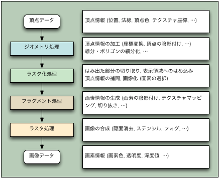
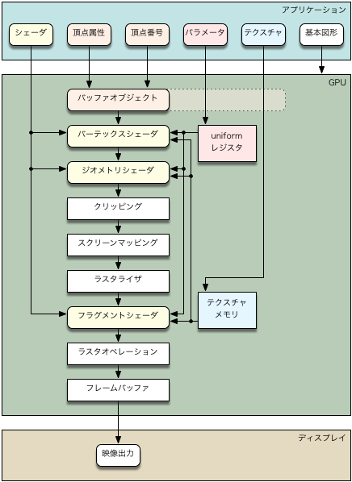

# 三角形の描画
<div align="center">

</div>

### 3DCGの処理の流れ
3DCGの処理の流れは以下の2つの図で表される通り、複数の工程を経る。その中で特に頂点に関する頂点に関する工程、ピクセルの色を決定するフラグメントの工程が重要で一般的にこの2つはカスタマイズされる。カスタマイズするために「シェーダー」が利用される。

<br>
[図引用元](https://marina.sys.wakayama-u.ac.jp/~tokoi/glfw/pipeline1.png)

<br>
[図引用元](https://marina.sys.wakayama-u.ac.jp/~tokoi/glfw/pipeline5.png)

### 頂点シェーダーとフラグメントシェーダー

- シェーダーの役割<br>
OpenGLは3DCGを描画するための命令や処理を提供しない。命令や処理を定義するために「**シェーダー**」という仕組みが用意。

- 頂点シェーダー<br>
3Dモデルの頂点情報を処理するシェーダー。頂点の座標を変換、光や影などを計算するために使用。

- フラグメントシェーダー<br>
画面上の各ピクセルを処理するシェーダー。ピクセルの色を計算、テクスチャなどの画像情報を反映するために使用。

     

### シェーダーファイル
3DCGを描画するためにGLSLで記述。


- 頂点シェーダーファイル(default.vert)
     ```glsl
        #version 330 core
        layout (location = 0) in vec3 aPos;
        layout (location = 1) in vec3 aColor;
        out vec3 color;
        uniform float scale;
        void main(){
	        gl_Position = vec4(aPos.x + aPos.x * scale,
						        aPos.y + aPos.y * scale, 
						        aPos.z + aPos.z * scale, 
						        1.0);
	        color = aColor;
        }
     ```
     `#version 330`<br>
     GLSLのバージョンを指定。**必ず1行目に記述**。GLSLのバージョンは基本的にOpenGLと同一で、OpenGLが3.3ならばGLSLも3.3。

     `in`<br>
     入力データであることを表現

     `in vec3 aPos`<br>
     attribute変数を定義。attribute変数とは、頂点データに関する変数。「vec3」は、3つの要素を持つベクトル型。3Dモデルの頂点の座標を表す変数として「aPos」と名付けている

     `layout (location = 0) in vec3 aPos;`<br>
     OpenGLの内部データからどのように取り出されるかを定義。この例では、「location = 0」と指定されているため、OpenGLの内部データの中から、最初に格納された3つの要素が、「aPos」として取り出される

     `layout (location = 1) in vec3 aColor;`<br>
     location0番目が終って次に格納されている3要素を「aColor」としている。
         
     
     `out vec3 color;`<br>
     出力のattribute変数を定義。出力を3要素のベクトル「color」とする

     `uniform float scale;`<br>
     uniform変数を定義。uniform変数は頂点属性以外の汎用的なデータをシェーダに送るための変数。今回は「scale」という変数を入力データとしている。
     
     `void main(){}`<br>
     main関数内でシェーダーが実際に行う処理を定義。

     `gl_Position = vec4(略);`<br>
     **gl_Position**という組み込み変数に頂点データを渡す。gl_Positionが4要素のベクトル（x,y,z,w）なため、3要素(x,y,z)から4要素のベクトルに変換している。「w」は行列計算で便宜上必要な値。

     `color = aColor;`<br>
     colorを出力。この変数はフラグメントシェーダーの入力、つまり「in」変数に格納される。

- フラグメントシェーダーファイル(default.frag)
     ```glsl
        #version 330 core
        out vec4 FragColor;
        in vec3 color;
        void main(){
	        FragColor = vec4(color, 1.0f);
        }
     ```

     `out vec4 FragColor;`<br>
     出力形式を4要素のベクトル「FragColor」と定義

     `in vec3 color;`<br>
     頂点シェーダーの出力の「color」を受け取る。必ず頂点シェーダーで定義した時と同じ変数名にする必要。

     `FragColor = vec4(color, 1.0f);`<br>
     RGBA形式で出力。三角形の色を決定。

### シェーダーオブジェクト & プログラムオブジェクト
- シェーダーオブジェクト
     
     頂点シェーダー、フラグメントシェーダーを表すオブジェクト。以下の手順によってシェーダーオブジェクトを実行可能な状態にする。
     ```c++
     1. glCreateShader()    // シェーダーオブジェクト作成
     2. glShaderSource()    // ソースコードを読み込む
     3. glCompileShader()   // コンパイル
     ```

- プログラムオブジェクト

     頂点シェーダー、フラグメントシェーダーを結合したプログラムを表すオブジェクト。これによって、まとめてシェーダーを一度に実行可能。
     ```c++
     1. glCreateShader() // プログラムオブジェクト作成
     2. glAttachShader() // シェーダーを結合
     3. glLinkProgram()  // 実行可能な状態にする
     ```

### VAO, VBO, EBO
- VAO(Vertex Array Object:頂点配列オブジェクト)

     複数のVBOやEBOをまとめるオブジェクト

- VBO(Vertex Buffer Object: 頂点バッファオブジェクト)

     頂点情報(頂点の位置,色,法線.テクスチャ座標等)を格納するGPU側のバッファして事前に送信。

- EBO(Element Buffer Object: 要素バッファオブジェクト)

     頂点インデックスを格納するオブジェクト。具体的には, どの頂点がどの頂点と組み合わさって三角形を描画するかを記録したオブジェクト。<br>
     図形を描画する上で重複する頂点を減らしてメモリ効率を良くする

### VAO, VBO, EBOの手順
1. VAOを生成<br>
IDにVAOのポインタが格納される
     ```c++
     glGenVertexArrays(1, &ID);
     // 引数1: 生成するVAOの個数
     // 引数2: VAOのポインタ
     ```

2. VAOを有効化<br>
指定されたVAOをバインドして利用可能な状態にする
     ```c++
     glBindVertexArray(ID);
     // 引数1: VAOのポインタ
     ```

3. VBOを生成<br>
IDにVBOのポインタが格納される
     ```c++
     glGenBuffers(1, &ID);
     // 引数1: 生成するバッファオブジェクトの個数
     // 引数2: バッファオブジェクトのポインタ
     ```
4. VBOを有効化<br>
指定されたバッファオブジェクトをバインドして利用可能な状態にする。頂点バッファを指定するため「GL_ARRAY_BUFFER」。
     ```c++
     glBindBuffer(GL_ARRAY_BUFFER, ID);
     // 引数1:頂点バッファか頂点インデックスを指定
     // 引数2: バッファオブジェクトのポインタ
     ```

5. VBOに頂点データを格納<br>
有効化したVBOに対して頂点データを格納。頂点バッファを指定するため「GL_ARRAY_BUFFER」。データは何度も利用し描画に使うため「GL_STATIC_DRAW」。
     ```c++
     glBufferData(GL_ARRAY_BUFFER, size, vertices, GL_STATIC_DRAW);
     // 引数1:頂点バッファか頂点インデックスを指定
     // 引数2:転送するデータのサイズ
     // 引数3:転送するデータの先頭へのポインタ
     // 引数4:転送されたデータの使い方を指定
     ```
6. EBOを生成, 有効化, 頂点インデックスを格納<br>
VBOとほぼ同じ。VBOで「GL_ARRAY_BUFFER」だったものを「GL_ELEMENT_ARRAY_BUFFER」に変更するのみ。**VAOを有効化した状態でEBOを作成すると自動的にVAOにバインドされる**
     ```c++
     glGenBuffers(1, &ID);
     glBindBuffer(GL_ELEMENT_ARRAY_BUFFER, ID);
     glBufferData(GL_ELEMENT_ARRAY_BUFFER, size, indices, GL_STATIC_DRAW);
     ```
7. VBOを一時的に有効化
工程8でVBOを操作するためVBOを有効化する必要がある。指定するバッファオブジェクトのバインドして有効化。
```c++
glBindBuffer(GL_ARRAY_BUFFER, ID);
```

8. VBOにインデックスと書式を設定, 有効化
GLSLで指示した入力データのインデックスと書式を設定。入力要素数はGLSLでvec3としたため「3」。
     ```c++
     glVertexAttribPointer(layout, 3, GL_FLOAT, GL_FALSE, 0, (void*)0);
     // 引数1: 属性インデックス
     // 引数2: 入力要素数
     // 引数3: データ型
     // 引数4: 正規化するかどうか
     // 引数5: 属性間のバイトオフセットを指定
     // 引数6: バッファの先頭のポインタ
     
     glEnableVertexAttribArray(layout);
     // 引数1: 属性インデックス
     ```
     下図の場合, 頂点情報のバイトオフセットは「0」, 色情報のバイトオフセットは「12」になる。今回は頂点情報のみなため、引数5で「0」を指定
     

9. VBOを無効化
VBOを操作する工程8が終ったため、VBOを無効化。指定するバッファオブジェクトのバインドして「0」とすることで無効化。
     ```c++
     glBindBuffer(GL_ARRAY_BUFFER, 0);
     ```

### 図形描画
オブジェクトをまとめたVAOを用いてメインループ上で描画を行う。VAOを有効化した状態でEBOに格納された頂点インデックスを使用して図形を描画。以下の手順で描画を行う。

1. シェーダープログラムの有効化<br>
指定したシェーダープログラムを有効化
     ```c++
     glUseProgram(ID);
     ```
2. VAOの有効化<br>
作成したVAOを有効化
     ```c++
     glBindVertexArray(ID);
     ```
3. backバッファに図形を描画<br>
頂点インデックスを登録した場合、配列データからプリミティブを描画するglDrawElements関数を使用可能。indexはVAOにバインドしているのでここでは「0」
     ```c++
     glDrawElements(GL_TRIANGLES, 9, GL_UNSIGNED_INT, 0);
     // 引数1: 描画するプリミティブ
     // 引数2: 頂点数
     // 引数3: indexのデータ型
     // 引数4: indexが保存されているポインタ
     ```

4. 画面を更新<br>
frontバッファとbackバッファを交換
     ```c++
     glfwSwapBuffers(window);
     ```