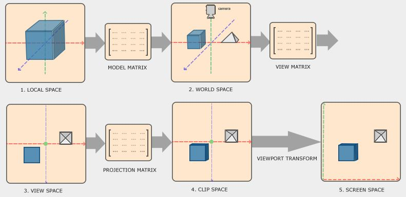

# 3Dオブジェクトの生成

### 3DCGモデルを扱う
3DCGを扱う上でデプス（深度）を考える必要がある。まず、デプステストを有効化する。
これは奥行きを考慮して画面上に描画するかどうかを判定する処理。<br>

次にメインループ内で色バッファ以外にデプスバッファも初期化する。

```c++
// デプステストの有効化
glEnable(GL_DEPTH_TEST);
// メインループ
while (略) {

	// 画面を初期化(色バッファ, デプスバッファを初期化)
	glClear(GL_COLOR_BUFFER_BIT | GL_DEPTH_BUFFER_BIT);
}
```
### 座標系と変換
3DCGモデルを描画するために5津の座標系が存在。
<br>
[Learn OpenGL](https://learnopengl.com/Getting-started/Coordinate-Systems)より引用

1. ローカル座標系<br>
   各3Dモデルが自分自身を表現するための座標系
2. ワールド座標系<br>
    全ての3Dモデルで共通の座標系
3. 視点座標系(ビュー座標系)<br>
    カメラから見た座標系
4. クリップ座標系<br>
    3Dの視点座標を投影して2Dの座標にした座標系
5. スクリーン座標系<br>
    実際の画面表示で使う座標系


- モデル変換行列<br>
モデルの位置、モデルの回転、モデルの拡大縮小を定義
    ```
		    モデル変換行列
    ローカル座標 --------------------> ワールド座標
    ```

- ビュー変換行列<br>
カメラの位置、カメラの注視点、カメラの上方向を定義
    ```
		    ビュー変換行列
    ワールド座標 --------------------> ビュー座標
    ```

- 投影変換行列<br>
ビュー座標から視錐台（描画範囲）の座標を求める。透視投影もしくは平行投影がある。
スクリーンの縦横比,クリッピング領域などを定義
    ```
		    投影変換行列
    ビュー座標 --------------------> クリップ座標
    ```

**より詳しく知りたい方は[３次元座標変換のメモ書き](https://zenn.dev/mebiusbox/articles/8e765148576919)**

### glm
[glm](https://glm.g-truc.net/0.9.9/)を用いて座標変換を行う。<br>
glmを「Libraries/include/」に格納。[動画](https://youtu.be/HiCVXEkkSK4)を見ると理解しやすいと思います。


### 座標変換をプログラミング
まず、座標変換で必要な「モデル変換行列」「ビュー変換行列」「投影変換行列」を初期化。
glmライブラリを用いて4×4の行列で初期化している。
```c++
glm::mat4 model = glm::mat4(1.0f);	// モデル変換行列
glm::mat4 view = glm::mat4(1.0f);	// ビュー変換行列
glm::mat4 proj = glm::mat4(1.0f);	// 投影変換行列
```
次に、モデル変換行列、ビュー変換行列にそれぞれ値を与える。説明は省略。<br>
そして投影変換行列を設定。今回は「透視投影」を行うためglm::perspective関数を使用。
ここでは画角、アスペクト比以外に、画面に映し出す範囲のビューボリュームの範囲(前方、後方)を指定。
```c++
glm::perspective(glm::radians(45.0f), (float)(width / height), 0.1f, 100.0f);
// 引数1: 画角
// 引数2: スクリーンのアスペクト比
// 引数3: 前方クリップ面
// 引数4: 後方クリップ面
```

最後に、これらの行列をuniform変数によってシェーダーに渡す。

```c++
glUniformMatrix4fv(modelLoc, 1, GL_FALSE, glm::value_ptr(model));
glUniformMatrix4fv(viewLoc, 1, GL_FALSE, glm::value_ptr(view));
glUniformMatrix4fv(projLoc, 1, GL_FALSE, glm::value_ptr(proj));
// 引数1: uniform変数の位置
// 引数2: 個数
// 引数3: 行列を転置するかどうか
// 引数4: 行列データ(ポインタで指定)
```