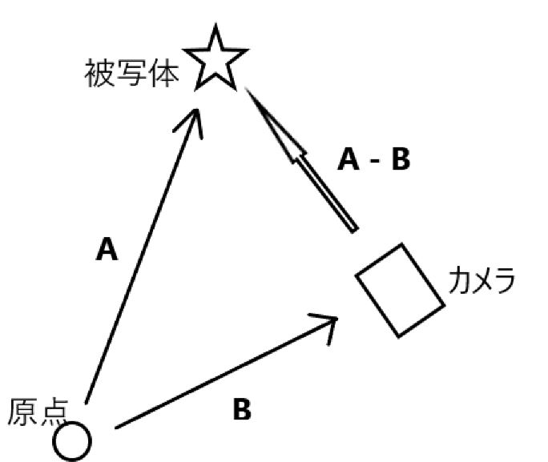

# カメラ設定

### 変換行列作成
default.vertに「camMatrix」というuniform変数を定義。これはビュー変換行列と投影変換行列をかけあわせた変換行列とする。
```glsl
// default.vert
uniform mat4 camMatrix;
void main(){
	gl_Position = camMatrix * vec4(aPos, 1.0);
}
```

この変数に代入するために「camera.cpp」において以下の関数を利用。
```c++
// camera.cpp
glUniformMatrix4fv(uniID, 1, GL_FALSE, glm::value_ptr(projection * view));
```

### ビュー変換行列作成
カメラを操作する、つまりビュー変換行列を作成するためにlookAt関数を利用。
この関数は「カメラの位置」「被写体の位置」「上向き」が必要。
```c++
glm::lookAt(Position, Target, Up);
// 引数1: カメラの位置
// 引数2: 被写体の位置
// 引数3: 正規化された上ベクトル。(0,1.0)に設定する(y軸が上)ことが一般的
```
X-Z平面を見渡すようにカメラを設置して、Y軸方向に上下に移動させながら撮影
ことが一般的なため、上ベクトルはy軸を上に設定。この上ベクトルはビュー座標系のy軸にあたる。
<br>

被写体の位置ベクトルは、カメラの視線ベクトルとカメラの位置ベクトルから計算可能。

```
被写体の位置ベクトル(A) - カメラの位置ベクトル(B) = カメラの視線ベクトル(A-B)
カメラの視線ベクトル + カメラの位置ベクトル = 被写体の位置ベクトル
```
<br>
ベクトルAを被写体の位置ベクトル、ベクトルBをカメラの位置ベクトルとすると、A-Bベクトルが視線ベクトルになる。
順序を入れ替えると、`カメラの視線ベクトル + カメラの位置ベクトル = 被写体の位置ベクトル`となる。


### カメラ操作
マウスの変化量に応じてカメラの回転角度を変化させる。
例えば、x方向の変化量は以下の式となる。画面の高さの半分を基準に差分を取り、正規化。最後に、感度(sensitivity)を掛け合わせて
x方向の変化量としている。y方向の変化量も同様に計算。
```
rotX = sensitivity * (float)(mouseY - (height / 2)) / height;
```
ビュー座標系のx軸を表す右ベクトルを計算する。
右ベクトルは上ベクトルとカメラの視線ベクトルの外積によって
計算可能
```c++
// 右ベクトル計算
glm::normalize(glm::cross(Orientation, Up);
```

そしてOrientationを更新するためにrotate関数を使用。x軸方向の回転ならば以下のようになる。
```c++
 glm::rotate(Orientation, glm::radians(-rotX), glm::normalize(glm::cross(Orientation, Up)));
// 引数1: 更新元のベクトル
// 引数2: 回転量
// 引数3: 軸
```
y軸方向の回転ならば以下のようになる。
```c++
glm::rotate(Orientation, glm::radians(-rotY), Up);
```