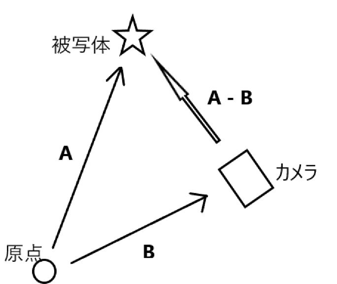

# カメラ設定

### 座標系
左手座標系と右手座標系があり、OpenGLは**右手座標系**。具体的には,親指がx軸,
人差し指がy軸, 中指がz軸とする座標系。この座標系の概念はカメラ設定で必要となる。


### 変換行列作成
default.vertに「camMatrix」というuniform変数を定義。これはビュー変換行列と投影変換行列をかけあわせた変換行列とする。
```glsl
// default.vert
uniform mat4 camMatrix;
void main(){
	gl_Position = camMatrix * vec4(aPos, 1.0);
}
```

この変数に代入するために「camera.cpp」において以下の関数を利用。
```c++
// camera.cpp
glUniformMatrix4fv(uniID, 1, GL_FALSE, glm::value_ptr(projection * view));
```

### ビュー変換行列作成
カメラを操作する、つまりビュー変換行列を作成するためにlookAt関数を利用。
この関数は「カメラの位置」「被写体の位置」「上向き」が必要。
```c++
glm::lookAt(Position, Target, Up);
// 引数1: カメラの位置
// 引数2: 被写体の位置
// 引数3: 正規化された上ベクトル。(0,1.0)に設定する(y軸が上)ことが一般的
```
X-Z平面を見渡すようにカメラを設置して、Y軸方向に上下に移動させながら撮影
ことが一般的なため、上ベクトルはy軸を上に設定。この上ベクトルはビュー座標系のy軸にあたる。
<br>

被写体の位置ベクトルは、カメラの視線ベクトルとカメラの位置ベクトルから計算可能。

```
被写体の位置ベクトル(A) - カメラの位置ベクトル(B) = カメラの視線ベクトル(A-B)
カメラの視線ベクトル + カメラの位置ベクトル = 被写体の位置ベクトル
```
<br>
ベクトルAを被写体の位置ベクトル、ベクトルBをカメラの位置ベクトルとすると、A-Bベクトルが視線ベクトルになる。
順序を入れ替えると、`カメラの視線ベクトル + カメラの位置ベクトル = 被写体の位置ベクトル`となる。


### カメラ操作
マウスの変化量に応じてカメラの回転角度を変化させる。
例えば、x方向の変化量は以下の式となる。画面の高さの半分を基準に差分を取り、正規化。最後に、感度(sensitivity)を掛け合わせて
x方向の変化量としている。y方向の変化量も同様に計算。
```
rotX = sensitivity * (float)(mouseY - (height / 2)) / height;
```
ビュー座標系のx軸を表す右ベクトルを計算する。
右ベクトルは上ベクトルとカメラの視線ベクトルの外積によって
計算可能
```c++
// 右ベクトル計算
glm::normalize(glm::cross(Orientation, Up);
```

そしてOrientationを更新するためにrotate関数を使用。x軸方向の回転ならば以下のようになる。
```c++
 glm::rotate(Orientation, glm::radians(-rotX), glm::normalize(glm::cross(Orientation, Up)));
// 引数1: 更新元のベクトル
// 引数2: 回転量
// 引数3: 軸
```
y軸方向の回転ならば以下のようになる。
```c++
glm::rotate(Orientation, glm::radians(-rotY), Up);
```

### Virtual Trackball
マウス操作によって回転を考える場合、**クォータニオン**が利用される。
クォータニオンとは１つの実数と３つの虚数で構成された概念である。
回転にクォータニオンを適用させることでオイラー角と比べて
比較的計算量が少ないながらもジンバルロックが発生しない、球面線形補間が可能という利点がある。

```
q = w + xi + yj + zk
```
また、ベクトル表記した場合は以下のようになる。
```
q = (w, v)
スカラー部: w
ベクトル部: v = <x, y, z>
```
クォータニオンを用いた回転は以下のように表すことができる。
```
q*p*q^(-1)
----
ここで, pは回転の対象となるクォータニオン p = (0, r)
正規化されたクォータニオンq = (cos(Θ / 2), sin(Θ / 2) n)
ただし、nは回転軸方向の単位ベクトル。
```

【手順】<br>
和歌山大学の床井先生のブログを参考にしている<br>
https://marina.sys.wakayama-u.ac.jp/~tokoi/?date=20040321

1. 相対量のマウス座標の変位を計算
	```c++
	double dx = (end_mouseX - start_mouseX) / width;
	double dy = (end_mouseY - start_mouseY) / height;
	```
1. 相対量のマウス移動距離を計算
	```c++
	double r = sqrt(dx * dx + dy * dy);
	```
1. 回転角の計算
    相対量のマウスの移動量が最大値の場合1回転するように設定。
	上記の通り、回転量の半分が必要なため、πをかけている。
	```c++
	double half_radian = r * glm::pi<float>();
	```
1. 回転軸の計算
    z軸を中心とした回転のクォータニオンを計算するため、z軸は0。
	そして、x軸正の方向にマウスを動かす時に、x軸は停止,y軸を動かしたいため、
	x軸方向にはyの変位を設定。同様にy軸方向にはxの変位を設定。
	そしてrで割ることで正規化している。
	```c++
	double axis_x = dy / r;
	double axis_y = dx / r;
	double axis_z = 0.0;
	```
1. クォータニオンの計算
    q = (cos(Θ / 2), sin(Θ / 2) n)。ただし、nは回転軸方向の単位ベクトル。ベクトル部にはsinがかかるため、r_sinをかけている。
	```c++
	double r_sin = sin(half_radian);
	glm::quat q = glm::quat(cos(half_radian), axis_x * r_sin, axis_y * r_sin, axis_z * r_sin);
	```

1. 位置・向き・上ベクトルをクォータニオンで更新
	```c++
	Position = q * Position;
	Orientation = q * Orientation;
	Up = q * Up;
	```
