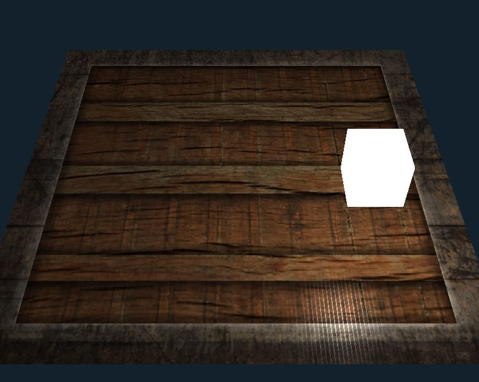
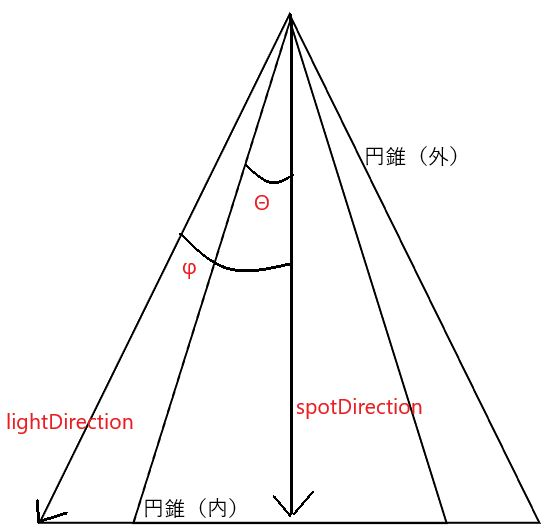

# 光



### 光源作成
立方体の光源を作成する。立方体の座標, 頂点インデックスを作成。<br>
そして、光源に関するシェーダーを作成。具体的には`default.vert`,`defalut.frag`とは別に`light.vert`,`light.frag`を作成。
シェーダー内で行うことは以前のものと大差はないため省略。<br>

次に、法線(normal)情報を頂点に付与する。これで頂点,色,テクスチャ座標,法線の合計11バイトの情報を各頂点に付与したことになる。
```c++
VAO1.LinkAttrib(VBO1, 0, 3, GL_FLOAT, 11 * sizeof(float), (void*)0);					// 頂点
VAO1.LinkAttrib(VBO1, 1, 3, GL_FLOAT, 11 * sizeof(float), (void*)(3 * sizeof(float)));	// 色
VAO1.LinkAttrib(VBO1, 2, 2, GL_FLOAT, 11 * sizeof(float), (void*)(6 * sizeof(float)));	// テクスチャ
VAO1.LinkAttrib(VBO1, 3, 3, GL_FLOAT, 11 * sizeof(float), (void*)(8 * sizeof(float)));	// 法線
```
光源に関するシェーダーに関してもVAO,VBO等、他と大差はない。光源の頂点は座標情報のみ有するため各頂点は3バイトの情報を持つ。
```c++
lightVAO.LinkAttrib(lightVBO, 0, 3, GL_FLOAT, 3 * sizeof(float), (void*)0);
```
これでシェーダー以外に関する光源の作成は完了。

### Phongの反射モデル
光の反射を単純化したPhongの反射モデルを利用。このモデルは「環境光」「拡散光」「鏡面反射光」で構成。

- ambient light: 環境光<br>
    暗い場合でも真っ黒にならない<br>
    実装として、被写体の色を小さな係数に乗算して光があるように見せる
    ```c++
    float ambientStrength = 0.1;
    vec3 ambient = ambientStrength * lightColor;
    ```

- diffuse light: 拡散光<br>
    光源に近いほど明るくなる<br>
    実装として光源と頂点がどれだけ離れているかを知る必要。光線ベクトルと頂点の法線ベクトルの
    角度によってどれだけ離れているかを知ることができる。具体的には光線ベクトルと頂点の法線の
    内積を求め, その値を光の色を乗算して拡散光とする。
    ```c++
    lightDir = normalize(光源座標 - 頂点座標);  // 光線ベクトル
    float diff = max(dot(normal, lightDir), 0.0);  // 内積 
    vec3 diffuse = diff * lightColor;  // 光の色に乗算
    ```

- specular reflection light: 鏡面反射光<br>
    反射によって出来る光の輝点を再現。<br>
    実装として光線ベクトル, 法線,視点ベクトルの3つが必要。光線ベクトルと法線から反射ベクトルを計算。
    そして、反射ベクトルと視点ベクトルの角度を計算し、その結果を係数と光の色に乗算して鏡面反射光とする。
    ```c++
    float specularStrength = 0.5; // 係数
    vec3 reflectDir = reflect(-lightDir, normal);  // 反射ベクトル
    float tmp = max(dot(viewDir, reflectDir), 0.0); // 内積(角度を計算)
    float spec = pow(tmp, 32); // 光沢度合いを決定, 値が大きいほどハイライトが小さい
    vec3 specular = specularStrength * spec * lightColor;  
    ```
最後に、これらの3つの光をまとめ上げる。これがPhongの反射モデルを基にした光計算。
```c++
vec3 rsult = (ambient + diffuse + specular) * logjtColor;
```

### PBRテクスチャ
PBRテクスチャとはより精密に物体を表現するためのテクスチャ。PBR(Physical Based Rendering)は
物理ベースレンダリングと訳され、よりリアルな表現方法。PBRで利用されるテクスチャは
いくつも種類があり、以下サイトで紹介されている。<br>
[Different maps in PBR Textures](https://www.a23d.co/blog/different-maps-in-pbr-textures/)

ここでは拡散反射マップとスペキュラーマップを紹介。

- 拡散反射マップ<br>
    物体のベースカラー(アルベド)を定義したテクスチャ。

- スペキュラーマップ<br>
    物体の光沢,具体的には環境光の影響度合いを定義したテクスチャ。
    スペキュラーマップは白いほど明るく表示される。
    スペキュラーマップを使用すると以下のように計算できる
    ```c++
    vec3 result1 = (ambient + diffuse) * lightColor;
    vec3 result2 = ((スペキュラーマップ) * specular係数) * lightColor;
    vec4 result = result1 * (通常のテクスチャ) + result2
    ```
    そして、赤要素を反射の強さと今回するため、以下のような実装となる。
    ```c++
    texture(tex1, texCoord).r
    ```

PBRテクスチャは以下からダウンロード
- [拡散反射マップ](https://learnopengl.com/img/textures/container2.png)
- [スペキュラーマップ](https://learnopengl.com/img/textures/container2_specular.png)


### 光源の種類
- 平行光源<br>
    光源の中で最もアルゴリズムが簡易。上記のPhongの反射モデルとほぼ同じ。異なるところは一定方向の光線`vec3(1.0f, 1.0f, 0.0f)`なところだけ。
    ```c++
    vec3 lightDirection = normalize(vec3(1.0f, 1.0f, 0.0f));
    ```
- 点光源<br>
    光の強度は距離の逆二乗の関係性があるがより多様な表現にするために以下の方程式が利用される。
    
    $I = \frac{1}{a * d^2 + b * d + 1}$

    aは二次項の係数, bは一次項の係数として働く。この2つの係数によって表現。ただし、ここでdは距離を表す。

- スポットライト<br>
    スポットライトは光の中心から離れると反射光がぼける性質がある。そこで**2つの円錐**
    を用いて再現する。そのために2つの係数`innerCone`と`outerCone`を用いる。この係数は
    スポットライトの方向ベクトルと内側もしくは外側の円錐ベクトルの間の角度を表す。そして
    光線方向とスポットライト方向の角度$\theta$とinnerConetとouterConeの角度差$\epsilon$によって
    光の強度が計算可能。ただし、光の強度は0.0から1.0の範囲なため実装ではclamp関数を用いて上限と
    下限を設けている。

    $I = \frac{\theta - outerCone}{\epsilon}$

    