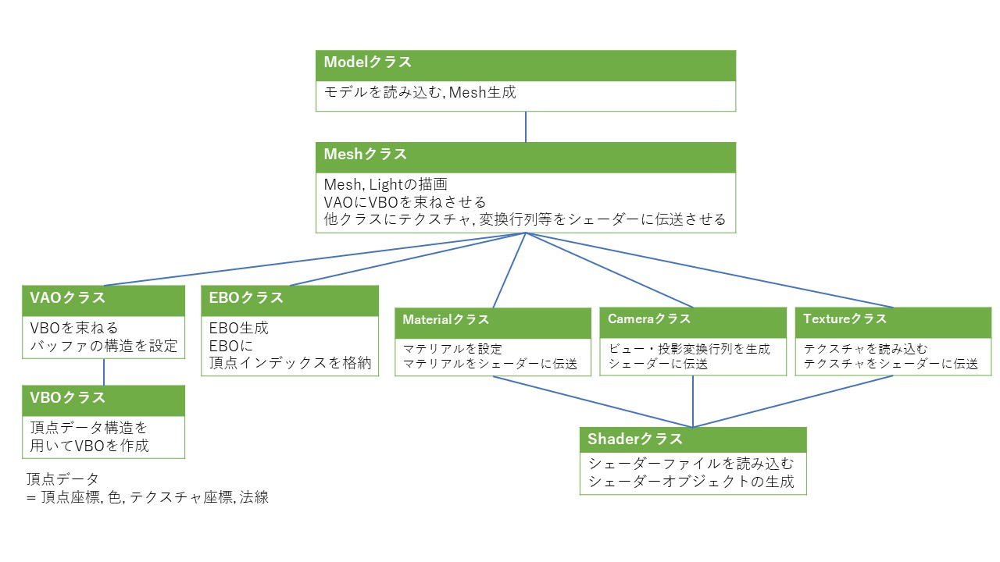
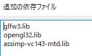

# モデル読み込み

### Meshクラス作成
複数クラスを束ねるMeshクラスを作成。そしてMeshクラスを使うためのクラス`Modelクラス`も作成する。



【メッシュとオブジェクトの違い】
- メッシュ<br>
頂点と面の集まりを指す、つまりポリゴンの形状データ。そのため、メッシュはオブジェクトは異なり、テクスチャやマテリアルは持たない
- オブジェクト<br>
物体を指す。ポリゴンモデルに限らず、ライト、カメラ等もオブジェクトと呼ぶ。

### 画像出力
stbライブラリを用いて画像出力を行う。
`stb.cpp`に以下を追加。そして「stb_image_write.h」を
`Libraries/include/stb/`に追加。

```
#define STB_IMAGE_WRITE_IMPLEMENTATION
#include<stb/stb_image_write.h>
```

そして, そのまま使用した場合にセキュリティエラーが生じるため
`stb_image_write.h`の`sprintf関数`を書き換えます。

```
sprintf() ----->  sprintf_s()
```


### 3Dデータのファイル形式
3Dデータの代表的なファイル形式に**obj**, **fbx**, **stl**, **glTF**がある。
- objファイル<br>
	3Dデータの頂点, テクスチャを記録。アニメーション情報を保持しない。
- fbxファイル<br>
	3Dデータの頂点, テクスチャ, リグを記録。リグを記録するためアニメーション情報を持つ。
- stlファイル<br>
	モデルを三角形の連結で描画。色やテクスチャ情報を持たない。3Dプリンター等に使用される。
- glTFファイル<br>
	モデルソフトに依存しない2017年に登場した比較的新しい形式。WebGLで利用される傾向。

今回は最も簡易的なobjファイルを読み込む。

### Assimpライブラリ
3Dモデルを読み込むためのライブラリ。複数のファイル形式を読み込むことが可能。

【インストール】<br>
インストール方法は[OpenGL Tutorial 0 - Install](https://youtu.be/XpBGwZNyUh0)のGLFWのインストール手順と同様。

1. `git clone https://github.com/assimp/assimp.git`でダウンロード
2. assimpフォルダの中にbuildフォルダを作成
3. cmake-guiを用いてassimpフォルダとbuildフォルダをそれぞれ指定してconfigureとgenerate
4. buildフォルダ内にある`Assimp.sln`を開き、ソリューションをビルド
5. buildフォルダ内にある`\build\include\assimp\config.h`を`include`フォルダに,`\build\lib\Debug\assimp-vc143-mtd.lib.h`を`lib`フォルダに格納。ただし、この`include`と`lib`は本フォルダ`GLFW_tutorial_JP\Libraries\`内にあるフォルダを指す。

そして、プロジェクトプロパティの追加の依存ファイルを以下のように指定。


次に`\build\bin\Debug\assimp-vc143-mtd.dll`を`GLFW_tutorial_JP\x64\Debug\`フォルダ内に`assimp-vc143-mtd.dll`を挿入。

### モデルの読み込み
モデルを扱うための`Model`クラスを作成する。

まず、ReadFile関数によってファイルを読み込む。ただし、ReadFileはMeshではなくSceneを出力するため、SceneをMeshに変換する必要がある。
```c++
Assimp::Importer importer ReadFile(const char* pFile, unsigned int pFlags )
// 引数1: ファイルパス名
// 引数2: 読み込み後処理フラグ
```
ReadFile関数の引数2のフラグは[aiPostProcessSteps
](https://assimp.sourceforge.net/lib_html/postprocess_8h.html#a64795260b95f5a4b3f3dc1be4f52e410)によって行われる。ドキュメントを参照されたい。

```c++
mesh->mMaterialIndex
/*
このとき、1つ目のメッシュのmaterialIndexフィールドには0、2つ目のメッシュのmaterialIndexフィールドには1が格納されています。

また、3Dモデルに適用されているマテリアルは、AssimpライブラリではaiMaterial構造体の配列として保持されます。そのため、materialIndexフィールドに格納されている番号を使用して、そのメッシュに適用されているaiMaterial構造体を取得することができます。
*/
```

|  名称  |  機能  |
| ---- | ---- |
|  aiProcess_Triangulate  |  全ての面を三角形分割  |
|  aiProcess_PreTransformVertices  |  ノード グラフを削除し、ノードのローカル変換行列を使用してすべての頂点を事前変換  |
|  aiProcess_CalcTangentSpace  |  メッシュのタンジェントとバイタンジェントを計算 |
|  aiProcess_GenSmoothNormals  |  すべての頂点に対してスムーズな法線を生成  |
|  aiProcess_GenUVCoords  |  適切なテクスチャ座標チャネルに変換  |
|  aiProcess_RemoveRedundantMaterials  |  冗長/参照されていないマテリアルを検索して削除  |
|  aiProcess_OptimizeMeshes	  |  メッシュ数を減らす  |

