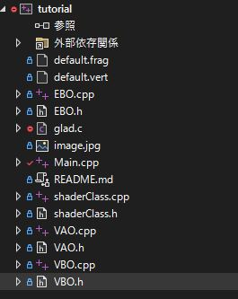

# GLFW_tutorial_JP
日本語GLFWチュートリアル

## 概要
[Victor Gordan氏によるOpenGLチュートリアル](https://www.youtube.com/playlist?list=PLPaoO-vpZnumdcb4tZc4x5Q-v7CkrQ6M-)を参考にしたGLFWチュートリアル。彼のチュートリアルの12章までの内容を網羅。最終目標は頂点やテクスチャ等を含んだMeshクラスの作成。

## 環境
|    |  version  |
| ---- | ---- |
|  OpenGL  |  3.3  |
|  GLFW  |  3.3.8 |
| Glad    | Language: C/C++    API gl: Version 3.3  Profile: Core |

## 準備
GLFWのインストール、Visual Studioの環境構築はVictor Gordan氏の動画を参考にしてください。

[OpenGL Tutorial 0 - Install](https://youtu.be/XpBGwZNyUh0)

## ファイル構造
tutorialというプロジェクトを作成した場合。プロジェクト作成時に自動的に作成される「ソース」等のディレクトリは削除。各回のディレクトリからファイルを「**追加→既存の項目**」で読み込む。ただし、「**glad.c**」は忘れないようにしてください。

 
例：第2回の場合のファイル構造

## 内容
1. ウィンドウ生成
2. 三角形生成
3. テクスチャ
4. 3Dオブジェクト生成
5. カメラ
5. 光
6. Meshクラス作成

